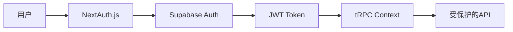
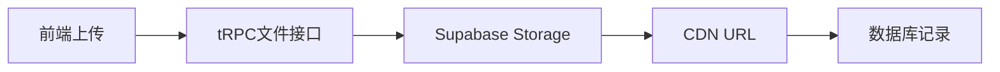
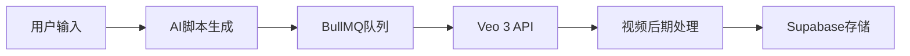

# 开发者个人品牌视频生成平台 - 技术栈配置

## 🏗 核心技术架构

### 前端层 (Frontend)
```typescript
const frontendStack = {
  framework: 'Next.js 15',
  language: 'TypeScript',
  styling: 'Tailwind CSS',
  components: 'shadcn/ui + Radix UI',
  stateManagement: 'Zustand',
  forms: 'React Hook Form + Zod',
  icons: 'Lucide React'
}
```

**选择理由:**
- **Next.js 15**: App Router、Server Components、内置优化
- **TypeScript**: 类型安全、更好的开发体验
- **Tailwind CSS**: 快速开发、一致的设计系统
- **shadcn/ui**: 现代化组件库、完全可定制

### API层 (Backend)
```typescript
const apiStack = {
  framework: 'tRPC',
  validation: 'Zod',
  serialization: 'Superjson',
  authentication: 'NextAuth.js',
  middleware: '自定义权限中间件'
}
```

**选择理由:**
- **tRPC**: 端到端类型安全、无需代码生成
- **Zod**: 运行时类型验证、与TypeScript完美集成
- **NextAuth.js**: 成熟的认证解决方案、支持多种登录方式

### 数据库层 (Database)
```typescript
const databaseStack = {
  platform: 'Supabase',
  database: 'PostgreSQL',
  orm: 'Drizzle ORM',
  auth: 'Supabase Auth',
  storage: 'Supabase Storage',
  realtime: 'Supabase Realtime'
}
```

**选择理由 - 为什么选择Supabase:**
- **PostgreSQL托管**: 免运维、自动备份、扩展性好
- **内置认证**: 减少代码复杂度、支持Magic Link
- **文件存储**: 直接集成、CDN加速
- **实时功能**: WebSocket支持、实时状态更新
- **成本效益**: 慷慨的免费额度、按用量付费

### 队列系统 (Queue)
```typescript
const queueStack = {
  system: 'Upstash Redis',
  library: 'BullMQ',
  jobs: ['script-generation', 'video-processing', 'notification'],
  dashboard: 'Bull Dashboard'
}
```

**选择理由:**
- **Upstash Redis**: 无服务器、自动扩展、简单配置
- **BullMQ**: 功能强大、支持重试、作业优先级

### 文件存储 (Storage)
```typescript
const storageStack = {
  primary: 'Supabase Storage',
  cdn: 'Supabase CDN',
  videoProcessing: 'Cloudflare R2 (备选)',
  backup: 'Supabase自动备份'
}
```

### AI服务 (AI Services)
```typescript
const aiStack = {
  scriptGeneration: 'OpenAI GPT-4 Turbo',
  videoGeneration: 'Google Veo 3',
  fallbackLLM: 'Anthropic Claude',
  imageProcessing: 'Sharp.js'
}
```

### 部署与监控 (Infrastructure)
```typescript
const infraStack = {
  hosting: 'Vercel',
  videoProcessing: 'Fly.io (容器)',
  monitoring: 'Sentry + Vercel Analytics',
  uptime: 'UptimeRobot',
  logs: 'Vercel Logs + Supabase Dashboard'
}
```

---

## 🔧 Supabase 具体配置

### 1. 数据库配置
```sql
-- Supabase项目设置
CREATE EXTENSION IF NOT EXISTS "uuid-ossp";
CREATE EXTENSION IF NOT EXISTS "pgcrypto";

-- 启用Row Level Security
ALTER TABLE users ENABLE ROW LEVEL SECURITY;
ALTER TABLE projects ENABLE ROW LEVEL SECURITY;
ALTER TABLE jobs ENABLE ROW LEVEL SECURITY;
```

### 2. 认证配置
```typescript
// Supabase Auth配置
const supabaseConfig = {
  auth: {
    providers: ['email'],
    emailAuth: {
      enableSignup: true,
      enableEmailConfirmation: true,
      enableMagicLink: true
    },
    security: {
      enableRowLevelSecurity: true,
      jwtSecret: process.env.SUPABASE_JWT_SECRET
    }
  }
}
```

### 3. 存储桶配置
```typescript
// Supabase Storage设置
const storageBuckets = {
  'user-photos': {
    public: false,
    fileSizeLimit: '10MB',
    allowedMimeTypes: ['image/jpeg', 'image/png', 'image/webp']
  },
  'product-images': {
    public: false,
    fileSizeLimit: '5MB',
    allowedMimeTypes: ['image/jpeg', 'image/png', 'image/webp']
  },
  'generated-videos': {
    public: false,
    fileSizeLimit: '100MB',
    allowedMimeTypes: ['video/mp4', 'video/webm']
  }
}
```

### 4. 环境变量配置
```env
# Supabase配置
NEXT_PUBLIC_SUPABASE_URL=your-project-url
NEXT_PUBLIC_SUPABASE_ANON_KEY=your-anon-key
SUPABASE_SERVICE_ROLE_KEY=your-service-role-key
SUPABASE_JWT_SECRET=your-jwt-secret

# 其他服务
OPENAI_API_KEY=your-openai-key
GOOGLE_VEO_API_KEY=your-veo-key
UPSTASH_REDIS_URL=your-redis-url
```

---

## 📦 依赖包配置

### 核心依赖
```json
{
  "dependencies": {
    "next": "^15.0.0",
    "react": "^18.2.0",
    "typescript": "^5.0.0",
    "@trpc/server": "^10.45.0",
    "@trpc/client": "^10.45.0",
    "@trpc/react-query": "^10.45.0",
    "@supabase/supabase-js": "^2.38.0",
    "@supabase/auth-helpers-nextjs": "^0.8.0",
    "drizzle-orm": "^0.29.0",
    "postgres": "^3.4.0",
    "zod": "^3.22.0",
    "zustand": "^4.4.0",
    "bullmq": "^4.15.0",
    "ioredis": "^5.3.0",
    "sharp": "^0.32.0"
  }
}
```

### 开发依赖
```json
{
  "devDependencies": {
    "@types/node": "^20.0.0",
    "@types/react": "^18.2.0",
    "drizzle-kit": "^0.20.0",
    "eslint": "^8.57.0",
    "prettier": "^3.0.0",
    "tailwindcss": "^3.4.0"
  }
}
```

---

## 🔄 数据流架构

### 1. 用户认证流程


### 2. 文件上传流程


### 3. 视频生成流程


---

## 🚀 开发环境设置

### 1. 项目初始化
```bash
# 创建Next.js项目
npx create-next-app@latest developer-trailer --typescript --tailwind --app

# 安装核心依赖
npm install @supabase/supabase-js @supabase/auth-helpers-nextjs
npm install @trpc/server @trpc/client @trpc/react-query @trpc/next
npm install drizzle-orm postgres drizzle-kit
npm install zod react-hook-form @hookform/resolvers
npm install zustand bullmq ioredis sharp
```

### 2. Supabase项目设置
```bash
# 安装Supabase CLI
npm install -g supabase

# 初始化项目
supabase init

# 链接到远程项目
supabase link --project-ref your-project-id

# 生成TypeScript类型
supabase gen types typescript --linked > lib/database.types.ts
```

### 3. 数据库迁移
```bash
# 创建迁移文件
supabase migration new create_initial_schema

# 应用迁移
supabase db push

# 生成Drizzle schema
npx drizzle-kit generate:pg
```

---

## ⚡ 性能优化配置

### 1. Next.js优化
```typescript
// next.config.js
const nextConfig = {
  experimental: {
    serverComponentsExternalPackages: ['sharp'],
  },
  images: {
    domains: ['your-supabase-project.supabase.co'],
    formats: ['image/webp', 'image/avif'],
  },
  env: {
    CUSTOM_KEY: process.env.CUSTOM_KEY,
  },
}
```

### 2. Supabase连接优化
```typescript
// lib/supabase.ts
import { createClient } from '@supabase/supabase-js'

export const supabase = createClient(
  process.env.NEXT_PUBLIC_SUPABASE_URL!,
  process.env.NEXT_PUBLIC_SUPABASE_ANON_KEY!,
  {
    auth: {
      persistSession: true,
      autoRefreshToken: true,
    },
    realtime: {
      params: {
        eventsPerSecond: 2,
      },
    },
  }
)
```

---

## 🔒 安全配置

### 1. Row Level Security策略
```sql
-- 用户只能访问自己的项目
CREATE POLICY "Users can only access their own projects" 
ON projects FOR ALL 
USING (auth.uid() = user_id);

-- 用户只能上传到自己的存储桶路径
CREATE POLICY "Users can upload to their own folder" 
ON storage.objects FOR INSERT 
WITH CHECK (bucket_id = 'user-photos' AND auth.uid()::text = (storage.foldername(name))[1]);
```

### 2. API安全
```typescript
// tRPC中间件
const authMiddleware = t.middleware(({ ctx, next }) => {
  if (!ctx.user) {
    throw new TRPCError({ code: 'UNAUTHORIZED' });
  }
  return next({
    ctx: {
      user: ctx.user,
    },
  });
});
```

---

这个技术栈配置充分利用了Supabase的优势，简化了开发复杂度，同时保持了系统的可扩展性和安全性。你有什么具体的技术问题想深入讨论吗？ 